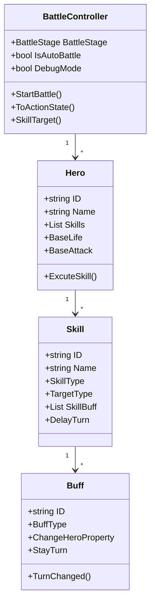

# DCTurnBasedBattle 学习指南

## 项目概述
DCTurnBasedBattle是一个基于Unity的回合制战斗系统，包含完整的战斗逻辑、英雄管理、技能系统和Buff/Debuff系统。

## 核心架构



## 关键组件说明

### 1. BattleController (战斗控制器)
- 核心单例类，管理整个战斗流程
- 主要状态：
  - InitSystem: 系统初始化
  - BeforeAction: 回合开始前
  - Actioning: 回合进行中
  - AfterAction: 回合结束后
  - CombatEnd: 战斗结束
  - ExitSystem: 退出系统

### 2. Hero (英雄实体)
- 包含英雄基本属性：生命值、攻击力、防御力等
- 技能列表(Skills)
- 战斗相关方法：执行技能、处理Buff等

### 3. Skill (技能系统)
- 技能类型：物理、魔法等
- 目标类型：敌方、友方、自身等
- 技能效果：属性变化、附加Buff等
- 蓄力机制(DelayTurn)

### 4. Buff (Buff/Debuff系统)
- Buff类型：增益/减益
- 作用时机：回合开始前、行动中等
- 持续时间(StayTurn)
- 属性变化效果(ChangeHeroProperty)

## 战斗流程
1. 初始化战斗(InitSystem)
2. 回合开始前(BeforeAction):
   - 计算行动顺序
   - 执行回合开始前的Buff/Skill
3. 回合行动(Actioning):
   - 英雄执行技能
   - 处理技能效果
4. 回合结束后(AfterAction):
   - 执行回合结束的Buff/Skill
   - 检查战斗是否结束
5. 战斗结束(CombatEnd)
6. 退出系统(ExitSystem)

## 示例代码分析

### 英雄执行技能流程
```csharp
// BattleController.cs
void Actioning() {
    _CurTurnHero.HeroActioning();
    if (_CurTurnHero.IsControlledByMine() && !IsAutoBattle) {
        // 等待玩家输入
        EventManager.Instance.TriggerEvent(EventsConst.OnWaitingPlayerInput);
    } else {
        // AI自动执行技能
        _CurTurnHero.AutoExcuteSkill();
    }
}
```

### Buff处理流程
```csharp
// Buff.cs
public void TurnChanged() {
    if (StayTurn <= 0) {
        OnBuffEnd();
        return;
    }
    StayTurn -= 1;
}
```

## 代码评价与优化建议

### 必须掌握的核心代码
1. BattleController状态机：
   - 战斗流程控制(InitSystem→BeforeAction→Actioning→AfterAction)
   - 回合切换逻辑(ToActionState)
   - 技能目标选择(SkillTarget)

2. Hero实体：
   - 基础属性管理
   - 技能执行流程
   - Buff效果应用

3. 技能系统：
   - 技能类型与目标选择
   - 技能效果链式调用
   - Buff附加机制

### 需要优化的部分
1. 战斗流程扩展性：
   - 使用策略模式重构状态切换
   - 增加自定义战斗阶段钩子

2. 技能效果处理：
   - 引入效果链(Effect Chain)模式
   - 支持复合技能效果

3. AI决策逻辑：
   - 实现基于Utility的AI决策系统
   - 增加技能优先级评估

4. 性能优化：
   - 对象池优化(HeroMono重用)
   - 事件系统性能分析

## 扩展建议
1. 新增技能类型：继承BaseSkill类
2. 自定义Buff效果：修改ChangeHeroProperty
3. 战斗AI优化：实现更智能的AutoExcuteSkill逻辑
4. 可视化编辑：开发技能/Buff编辑器插件
