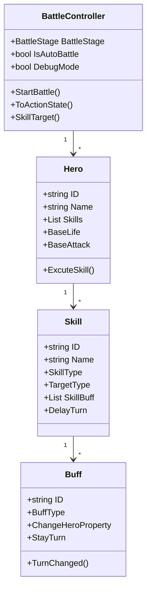

# DCTurnBasedBattle 学习指南

## 项目概述
DCTurnBasedBattle是一个基于Unity的回合制战斗系统，包含完整的战斗逻辑、英雄管理、技能系统和Buff/Debuff系统。

## 核心架构



## 关键组件说明

### 1. BattleController (战斗控制器)
- 核心单例类，管理整个战斗流程
- 主要状态：
  - InitSystem: 系统初始化
  - BeforeAction: 回合开始前
  - Actioning: 回合进行中
  - AfterAction: 回合结束后
  - CombatEnd: 战斗结束
  - ExitSystem: 退出系统

### 2. Hero (英雄实体)
- 包含英雄基本属性：生命值、攻击力、防御力等
- 技能列表(Skills)
- 战斗相关方法：执行技能、处理Buff等

### 3. Skill (技能系统)
- 技能类型：物理、魔法等
- 目标类型：敌方、友方、自身等
- 技能效果：属性变化、附加Buff等
- 蓄力机制(DelayTurn)

### 4. Buff (Buff/Debuff系统)
- Buff类型：增益/减益
- 作用时机：回合开始前、行动中等
- 持续时间(StayTurn)
- 属性变化效果(ChangeHeroProperty)

## 战斗流程
1. 初始化战斗(InitSystem)
2. 回合开始前(BeforeAction):
   - 计算行动顺序
   - 执行回合开始前的Buff/Skill
3. 回合行动(Actioning):
   - 英雄执行技能
   - 处理技能效果
4. 回合结束后(AfterAction):
   - 执行回合结束的Buff/Skill
   - 检查战斗是否结束
5. 战斗结束(CombatEnd)
6. 退出系统(ExitSystem)

## 示例代码分析

### 英雄执行技能流程
```csharp
// BattleController.cs
void Actioning() {
    _CurTurnHero.HeroActioning();
    if (_CurTurnHero.IsControlledByMine() && !IsAutoBattle) {
        // 等待玩家输入
        EventManager.Instance.TriggerEvent(EventsConst.OnWaitingPlayerInput);
    } else {
        // AI自动执行技能
        _CurTurnHero.AutoExcuteSkill();
    }
}
```

### Buff处理流程
```csharp
// Buff.cs
public void TurnChanged() {
    if (StayTurn <= 0) {
        OnBuffEnd();
        return;
    }
    StayTurn -= 1;
}
```

## 战斗系统调用方式

### 1. 随机遭遇战
```csharp
// 示例：在地图移动时随机触发战斗
void OnPlayerMove() {
    if(Random.Range(0f,1f) < encounterRate) {
        List<Hero> playerTeam = GetPlayerTeam();
        List<Hero> enemyTeam = GenerateRandomEnemies();
        BattleController.Instance.StartBattle(playerTeam, enemyTeam);
    }
}
```

### 2. 剧情触发战斗
```csharp
// 示例：剧情对话后触发固定战斗
void OnStoryTrigger(string storyId) {
    if(storyId == "boss_battle") {
        List<Hero> playerTeam = GetPlayerTeam();
        List<Hero> bossTeam = GetBossTeam();
        BattleController.Instance.StartBattle(playerTeam, bossTeam);
    }
}
```

### 3. 玩家主动战斗
```csharp
// 示例：玩家点击敌人触发战斗
void OnEnemyClicked(Enemy enemy) {
    List<Hero> playerTeam = GetPlayerTeam();
    List<Hero> enemyTeam = new List<Hero>{ enemy.GetHeroData() };
    BattleController.Instance.StartBattle(playerTeam, enemyTeam);
}
```

## 代码评价与优化建议

### 必须掌握的核心代码
1. BattleController状态机：
   - 战斗流程控制(InitSystem→BeforeAction→Actioning→AfterAction)
   - 回合切换逻辑(ToActionState)
   - 技能目标选择(SkillTarget)

2. Hero实体：
   - 基础属性管理
   - 技能执行流程
   - Buff效果应用

3. 技能系统：
   - 技能类型与目标选择
   - 技能效果链式调用
   - Buff附加机制

### 需要优化的部分
1. 战斗流程扩展性：
   - 使用策略模式重构状态切换
   - 增加自定义战斗阶段钩子

2. 技能效果处理：
   - 引入效果链(Effect Chain)模式
   - 支持复合技能效果

3. AI决策逻辑：
   - 实现基于Utility的AI决策系统
   - 增加技能优先级评估

4. 性能优化：
   - 对象池优化(HeroMono重用)
   - 事件系统性能分析

## RPG数值测试指南

### 1. 基础属性测试
```csharp
// 快速创建测试英雄
Hero CreateTestHero(float hp, float atk, float def) {
    return new Hero {
        BaseLife = hp,
        BaseAttack = atk,
        BaseDefense = def
    };
}

// 示例：测试不同属性组合
void TestHeroAttributes() {
    var tank = CreateTestHero(1000, 50, 200);
    var dps = CreateTestHero(500, 150, 50);
    BattleController.Instance.StartBattle(new List<Hero>{tank}, new List<Hero>{dps});
}
```

### 2. 技能效果测试
```csharp
// 使用DebugMode快速验证技能
void TestSkillEffect() {
    BattleController.Instance.DebugMode = true;
    // 设置测试技能参数
    skill.DamageFactor = 1.5f; 
    skill.CriticalRate = 0.3f;
    BattleController.Instance.StartBattle(testTeam1, testTeam2);
}
```

### 3. 自动化测试方案
1. 批量战斗测试：
```csharp
for(int i=0; i<100; i++) {
    BattleController.Instance.StartBattle(randomTeam1, randomTeam2);
    RecordBattleResult();
}
```

2. 数据采集：
- 战斗时长统计
- 技能使用频率
- 胜负比率分析

3. 平衡调整建议：
- HP/ATK/DEF黄金比例 ≈ 10:1:0.5
- 技能冷却回合建议2-4回合
- Buff效果建议不超过3回合

## RPG数值测试方案

### 1. 基础测试方法
```csharp
// TestCombat.cs中的测试用例示例
[Test]
public void TestHeroDamageCalculation() {
    Hero attacker = CreateTestHero(attack: 100);
    Hero defender = CreateTestHero(defense: 50);
    
    int damage = attacker.CalculateDamage(defender);
    Assert.IsTrue(damage >= 40 && damage <= 60, "伤害计算异常");
}
```

### 2. 核心测试点
1. 属性平衡测试：
   - 生命值/攻击力/防御力比例
   - 暴击/闪避概率验证
   - 技能消耗与效果平衡

2. 战斗节奏测试：
   - 标准战斗回合数(3-5回合)
   - 技能冷却时间验证
   - Buff持续时间测试

3. 自动化测试方案：
```csharp
// 批量属性测试示例
[Test]
public void BatchTestHeroProperties() {
    for(int atk = 50; atk <= 200; atk += 50) {
        for(int def = 30; def <= 150; def += 30) {
            TestDamageRange(atk, def);
        }
    }
}
```

### 3. 测试工具使用
1. 调试模式：
```csharp
// 启用调试输出
BattleController.Instance.DebugMode = true;
```

2. 快速测试命令：
```csharp
// 控制台命令示例
DebugCommand("test_combat 英雄ID1 英雄ID2 回合数");
```

## 扩展建议
1. 新增技能类型：继承BaseSkill类
2. 自定义Buff效果：修改ChangeHeroProperty
3. 战斗AI优化：实现更智能的AutoExcuteSkill逻辑
4. 可视化编辑：开发技能/Buff编辑器插件
5. 增强测试工具：添加数值平衡分析功能
